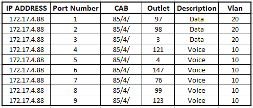

# autodescript
Script that automates port description configurations by 
iterating through each row using those variables to conifgure
Vlans and port descriptions

## Sample Spreadsheet

## Prerequites
Netmiko  
Paramiko  
Python 3.X

